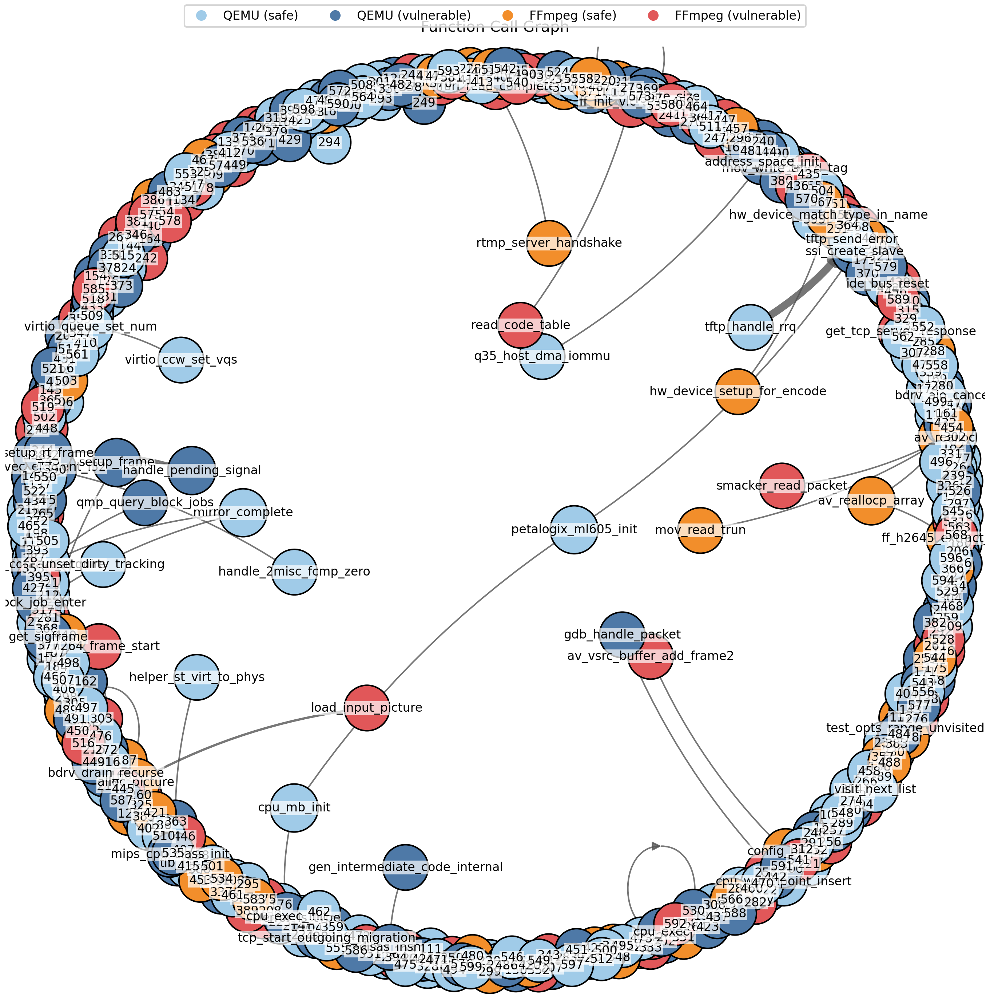
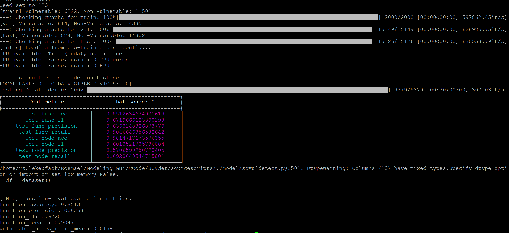

# SCVdet  

#### Modeling Function-Level Relationships for Vulnerability Detection in Graph Neural Networks

This repository contains the implementation of our GNN model for vulnerability detection by modeling function-level relationships in source code.  

## 1. Dataset  & Data Processing 
We use two real-world datasets constructed from Java and C/C++ code:  
- **Dataset 1**: ProjectKB  
- **Dataset 2**: QEMU+FFmpeg  
For graph data extraction from source code, we use **Joern**, an open-source code analysis tool. The automated extraction process is implemented in the provided scripts. Run ``` ./installJoernanddata.sh``` to install.

```sh
chmod +x installJoernanddata.sh
./installJoernanddata.sh
```

## 3. Function-Level Relationship Modeling  
We approximate relationships using constructed graphs of individual source code functions.  

## Source Code Execution  

### 1. Data Processing & Graph Extraction  
The graph extraction time varies depending on the runtime environment and dataset size.  

```sh
cd sourcescripts  
python3 -B ./processing/process.py  
python3 -B ./processing/graphdata.py  
```
### 2. Node Feature Generation
We train sequence-based models (CodeBERT, Word2Vec, and SBERT) to generate node features, and then construct graphs for model training. We provide the three fine-tuned models used for text embedding, as well as metadata extracted from Joern[(https://joern.io/)] for the project KB graphs, which can be directly downloaded when ```./installJoernanddata.sh``` is run.

To prepare the dataset, navigate to ```/storage/processed```, unzip the files, and delete all folders while keeping only the ```"before," "after,"``` and ```"eval"``` folders. Place these folders data in the ```storage/processed/dataset``` directory.

```sh
python3 -B ./processing/graphconstruction.py 
```

### 3. Model Training & Testing
The model is trained and tested at both function and statement levels. Output (```./stoarge/outputs/```) includes:
 - Classification metrics
 - A CSV of model predictions for each function
 - Detailed predictions per code line (with line numbers)
 - Unique function IDs and corresponding source code (stored in ``` ./storage/processed/before```)

```sh
python3 -B ./model/scvuldetect.py  
```

### 4 Pre-trained Models

We provide a pre-trained model at the following link: [Download Pre-trained Model](https://drive.google.com/file/d/1UAC4Er_pPT5QPDVlUR6caxT7wWe9HBiM/view?usp=sharing). This includes full graphs constructed with project KB data, which can be used after downloading the complete package. 

To set up the environment, create a virtual environment (with ```requirements.txt```) and run the following command to test the model:

```sh
python3 -B ./model/scvuldetect.py
```

## Sample Output
Go to ```outputdata/```
#### 500-node dependency graph


#### Model tested on Bigvul



